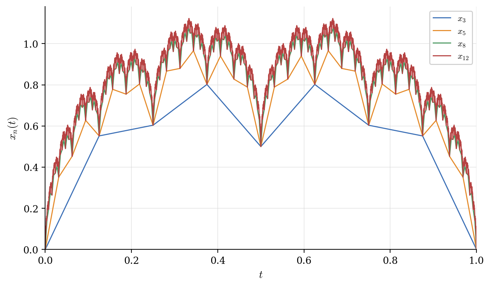
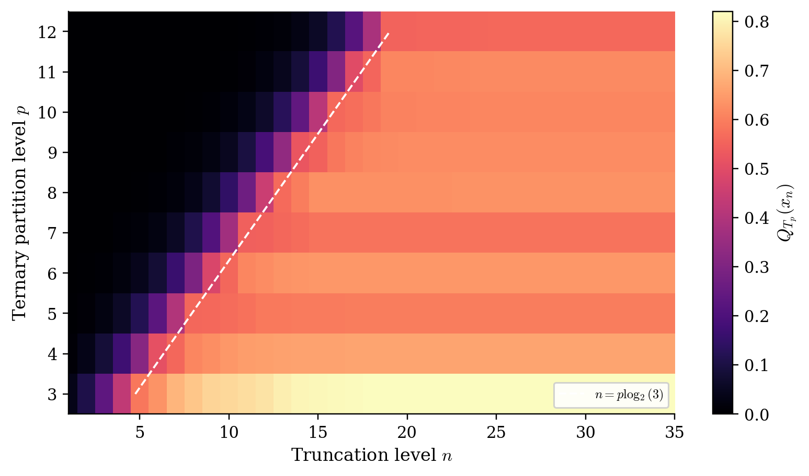
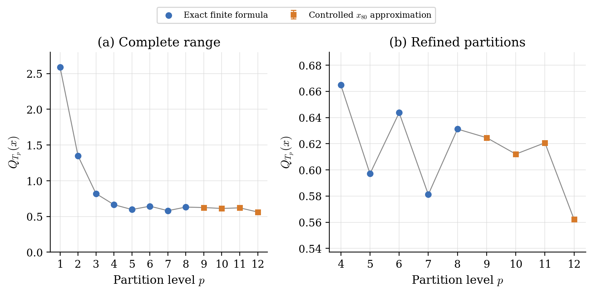

# Quadratic Variation of a Takagi Function

This repository contains the theory-facing numerical code accompanying my summer 2026 research report, **“Quadratic Variation of the Constant-Coefficient Takagi Function Along Ternary Partitions.”**

The project arose from a research internship conducted under the supervision of **Professor Rama Cont** at the Mathematical Institute, University of Oxford.

The function studied is the normalised constant-coefficient Takagi function

$$
x(t)=\sum_{m=0}^{\infty}2^{-m/2}\mathrm{dist}(2^m t,\mathbb Z),
\qquad t\in[0,1].
$$

The central question is how its quadratic sums depend on the geometry of the refining partitions.



## Main results

- **Dyadic partitions.** The dyadic grid is aligned with the Faber–Schauder expansion, giving the exact identity

  $$Q_{D_p}(x)=1-2^{-p},$$

  and hence quadratic variation equal to one.

- **Ternary partitions.** The alignment is lost. Using the multiplicative order

  $$\mathrm{ord}_{3^p}(2)=2\cdot3^{p-1},$$

  together with the symmetry of the tent function, every ternary increment can be reduced to an exact finite computation.

- **Critical scaling.** Numerical experiments for the partial sums $x_n$ reveal a transition near

  $$n\approx p\log_2(3),$$

  corresponding to the comparison of the smallest dyadic scale $2^{-n}$ with the ternary mesh $3^{-p}$.

- **Open asymptotics.** The computed values of $Q_{T_p}(x)$ remain non-negligible and fluctuate over the investigated range. These computations do not establish whether the sequence converges as $p\to\infty$.





## Repository structure

```text
├── src/takagi_qv/        Reusable mathematical functions
├── experiments/          Scripts reproducing the report figures
├── tests/                Numerical checks of the exact identities
├── data/                 Generated numerical values
├── figures/              Reproducible PDF and PNG figures
└── report/               Full research report
```

The implementation keeps the ternary nodes as integer residues modulo $3^p$. This avoids loss of fractional information when the truncation level becomes large.

## Reproduce the computations

Create an environment and install the package:

```bash
python -m venv .venv
source .venv/bin/activate
python -m pip install -e ".[dev]"
```

Run the tests:

```bash
pytest
```

Regenerate all figures and the numerical data:

```bash
python experiments/generate_overview_figures.py
python experiments/generate_section6_figures.py
```

The second command reproduces the parameter sweeps for $1\leq p\leq12$ and $1\leq n\leq35$. It evaluates the exact finite formula for $p\leq8$ and uses a controlled $x_{80}$ approximation, with an explicit truncation bound, for $9\leq p\leq12$.

## Research transparency

The repository distinguishes between:

- identities established theoretically;
- exact finite numerical evaluations;
- controlled truncations with explicit error bounds;
- empirical observations that remain open asymptotically.

The accompanying [research report](report/Maya_Smaoui_Takagi_Quadratic_Variation_2026.pdf) contains the full proofs and discussion. It is a research report, not a peer-reviewed publication.

## Author

**Maya Smaoui**  
Mathematics and Computer Science, University of Edinburgh  
[LinkedIn](https://www.linkedin.com/in/maya-smaoui-205071271)
